# TP3 - Mips

## Introducción

El trabajo consiste en la implementación en FPGA de un procesador MIPS, desarrollado en el lenguaje de descripción de hardware Verilog.

El mismo debe contar con los siguientes requisitos:

### Segmentado en etapas

El procesador debe estar segmentado en 5 etapas para funcionar como un pipeline, estas etapas son:

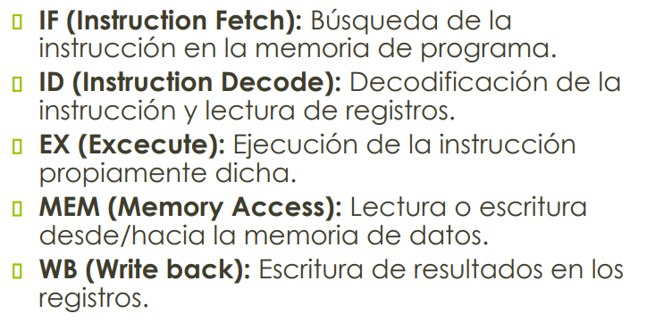

### Instrucciones a implementar

El set de instrucciones es el del MIPS IV, y debe contener las siguientes instrucciones.


### Control de riesgos

El pipeline de procesador debe ser capaz de manejar los siguientes tipos de riesgo:

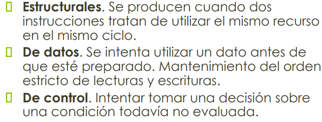

Implementando los siguientes elementos:


### Forma de operar

Para interactuar con el procesador se deben tener en cuenta los siguientes requerimientos:

1. Carga de programa:
    
    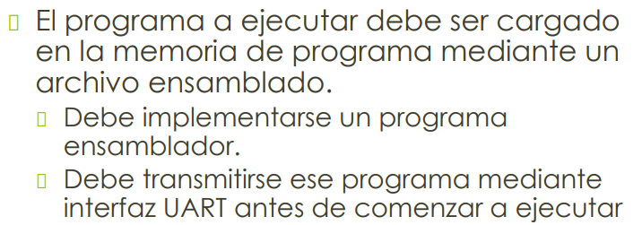
    
2. Unidad de Debug:
    
    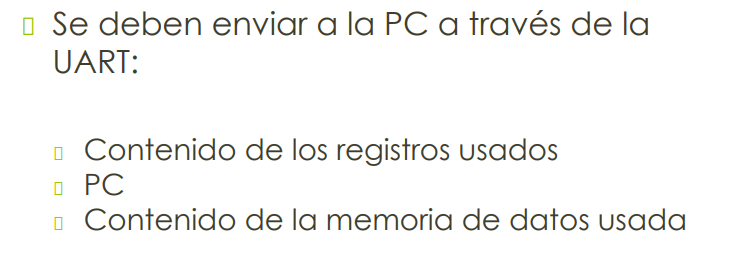
    
3. Modos de Operación:
    
    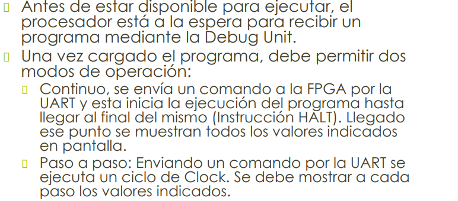
    

## Etapas

### Instruccion Fetch

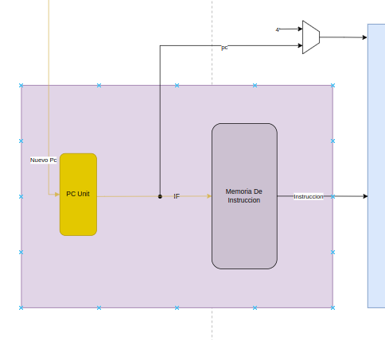

En esta se encuentra un registro de 8 bits que denominamos, Program Counter (PC), que direcciona la memoria de instrucción. La memoria es de 256 bytes, este tamaño es arbitrario y es así con el único fin de que los test del programa se ocupen correctamente.

### Instruccion Decode


Esta etapa tiene 3 funcionalidades:

1. Obtener los datos para las siguientes etapas, ya sea del registro o de la instrucción.
    
    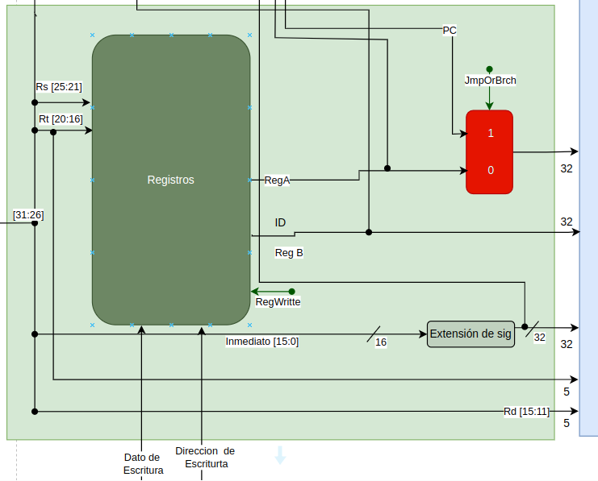
    
    Los registros son modelados por 32 registros de 4 bytes cada uno, direccionados con 5 bits.
    
2. Proveer la siguiente dirección de memoria a la etapa anterior.
    
    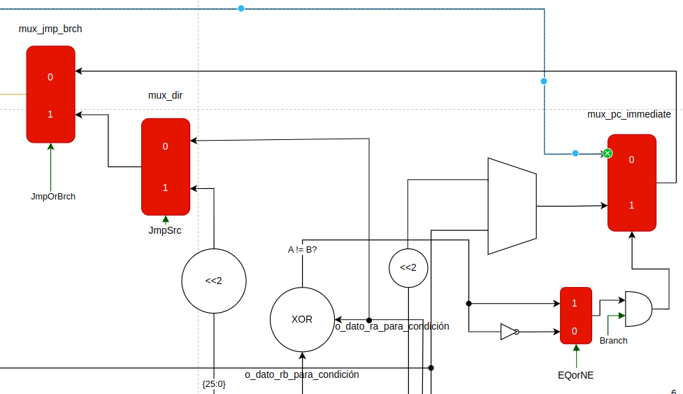
    
3. A partir de la estructura de la instrucción, distinguir el tipo de instrucción y que acciones lleva adelante. Esta se va a detallar en capítulos siguientes, pero es representada por las flechas de color verde que están en los gráficos.

## Execute

Esta etapa recibe los datos de la etapa anterior y usa la Unidad Lógica Aritmética (ALU) para obtener un resultado.

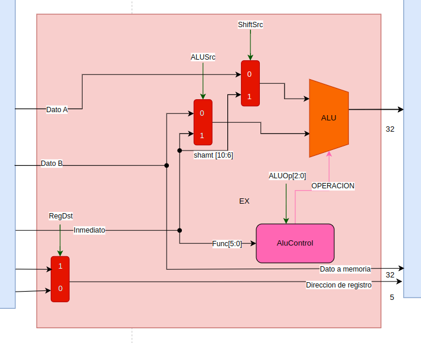

Los el dato usado por la ALU se discrimina con señales de control y la operación a utilizar es decidida a través de otra señal de control que indica de donde obtenerla.

### Memory Access

Esta etapa decide si se utiliza la memoria o simplemente se sigue a la siguiente etapa.

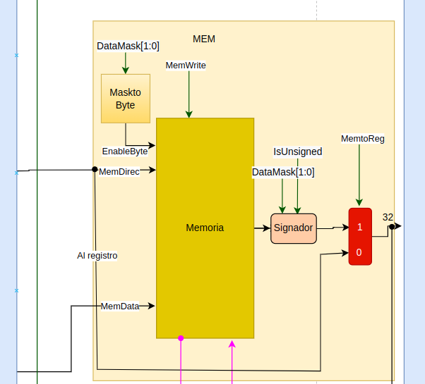

La memoria que se modela es una de 32 Bytes porque en términos prácticos para nuestros casos de uso no son necesarios más.

Las señales de control señalizadas en verde muestran si la memoria va a ser leída o escrita, o si directamente no se va a utilizar.

### Write Back

Esta etapa solamente escribe los datos en los registros en caso de hacerlo.

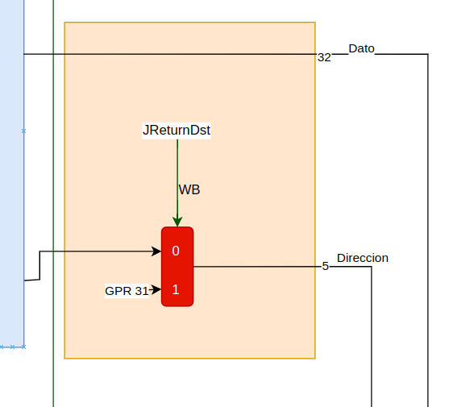

A la salida de esta etapa está el enable de escritura del registro, el dato a escribir y la dirección de escritura que es determinada por una señal de control.

## Instrucciones

Las instrucciones se dividen en 3 tipos:

- Tipo R: Aritmeticas logicas
    
    
    
    - op: Identificacion de la operacion
    - rs, rt, rd: Identificacion de registros fuentes y destino
    - shamt: Cantidad a desplazar (en Shift)
    - funct: Operacion aritmetica a realizar
- Tipo I: Con memoria / saltos condicionales
    
    
    
    - inmediato: literal para hacer la operación
- Tipo J: Saltos incondicionales
    
    
    
    - dirección: direc de destino de salto

Las instrucciones a implementar son:

| Categoria | Instrucción | Tipo | Ejemplo | Comentario |
| --- | --- | --- | --- | --- |
| Aririmetica | ADDU | R | addu $s1,$s2,$s3 | Suma Unsigned entre registros |
|  | SUBU | R | sub $s1,$s2,$s3 | Resta Unsigned entre registros |
|  | ADDI | I | addi $s1,$s2,20 | Suma inmediata |
| Tranferencia de informacion | LB | I | lb $s1,20($s2) | Load Byte |
|  | LH | I | lh $s1,20($s2) | Load Half |
|  | LW | I | lw $s1,20($s2) | Load Word |
|  | LWU | I | lwu $s1,20($s2) | Load Word Unsigned |
|  | LBU | I | lbu $s1,20($s2) | Load Byte Unsigned |
|  | LHU | I | lhu $s1,20($s2) | Load Half Unsigned |
|  | SB | I | sb $s1,20($s2) | Store Byte |
|  | SH | I | sh $s1,20($s2) | Store Half |
|  | SW | I | sw $s1,20($s2) | Store Word |
|  | LUI | I | lui $s1,20 | Load Upper Inmediato |
| Logica | SLL | R | sll $s1,$s2,10 | Shift Left Logical |
|  | SRL | R | srl $s1,$s2,10 | Shift Right Logical |
|  | SRA | R | sra $s1,$s2,10 | Shift Rigth Arithmetical |
|  | SLLV | R | sllv $s1,$s2,10 | Shift Left Logical Inmediato |
|  | SRLV | R | srlv $s1,$s2,10 | Shift Right Logical Inmediato |
|  | SRAV | R | srav $s1,$s2,10 | Shift Right Arithmetical Inmediato |
|  | AND | R | and $s1,$s2,$s3 | Operacion AND |
|  | OR | R | or $s1,$s2,$s3 | Operacion OR |
|  | XOR | R | xor $s1,$s2,$s3 | Operacion XOR |
|  | NOR | R | nor $s1,$s2,$s3 | Operacion NOR |
|  | SLT | R | slt $s1,$s2,$s3 | Operacion AND |
|  | ANDI | I | andi $s1,$s2,20 | Operacion AND Inmediata |
|  | ORI | I | ori $s1,$s2,20 | Operacion OR Inmediata |
|  | XORI | I | xori $s1,$s2,20 | Operacion XOR Inmediata |
|  | SLTI | I | slti $s1,$s2,20 | Menor que, inmediata |
| Salto Conditional | BEQ | I | beq $s1,$s2,25 | Salta si es igual |
|  | BNE | I | bne $s1,$s2,25 | Salta si no es igual |
| Salto Incondicional | JR | I | jr $ra | Salta a direccion de registro |
|  | JALR | I | jalr $s1,s10 | Salta a direccion de registro y guardar retorno |
|  | J | J | j 2500 | Salta a direccion inmediata |
|  | JAL | J | jal 2500 | Salta a direccion inmediata y guardar retorno |
|  | HALT | H | halt | Instrucción de Halt |

No es necesario entrar en detalle en los campos puntuales de cada instrucción, ya que recopilar los 32 bits de cada una de las instrucciones no aportaría informacion real. Si se desea consultar se puede usar consultar la bibliográfia o ver la [tabla](https://docs.google.com/spreadsheets/d/1dgxqz1_EhHrhEbsWYqw2bOFsNHnYlma1rU1OkBtsGY0/edit?usp=sharing) que nosotros mismos confeccionamos.

Para destacar solamente hay que comentar que se identifico que a través de los campo OP y FUNC, de cada instrucción es posible identificar el tipo que es y crear un [diagrama de control](https://drive.google.com/file/d/1BnADQIdirR9sN8iCnYDk7RPJ0OcQA-6T/view?usp=sharing). 

### Unidad de Control

Como se dijo anteriormente, a traves del diagrama de control se logra identificar el tipo y la instruccion a ejecutar. Para esto se usan distintas señales que indican etapa a etapa, que se debe hacer.

Las señales son las siguientes:

| Señales | Si es 1 | Si es 0 |
| --- | --- | --- |
| RegDst | La dirección de escritura del registro esta en los bits [15-11] (Tipo R). | La dirección de escritura del registro esta en los bits [20-16] (Tipo I). |
| MemToReg | El dato sale de la memoria (Load) | El dato sale de la ALU |
| MemRead | Lee de memoria (Load) | No lee de la memoria |
| Branch | Debe evaluar la condición de salto | No debe evaluar la condición |
| MemWrite | Escribe en la memoria (Store) | No escribe en memoria |
| OP[2:0] | Informa a la Alu control de que operación debe ejecutar |  |
| ALUSrc | El operando de la alu es un valor inmediato | El operando de la alu es un valor obtenido del registro |
| RegWrite | Escribe en registro  | No escribe en registro |
| ShiftSrc | El valor de shift es un inmediato | El valor de shift viene del registro |
| JmpSrc | La dirección de salto es un inmediato | La dirección de salto esta en el registro |
| JReturnDst | El valor de retorno se guarda en la dirección de registro 31 | El valor de retorno se escribe en la dirección que viene en la instrucción |
| EQorNE | La condición de salto es por No Igual | La condición de salto es por Igual |
| DataMask[1:0]
 | Determina la Mascara del dato, si es 00 la mascara es de un byte, si es 01 la Mascara es de media palabra y si es 11 de la palabra. |  |
| IsUnsigned | El valor no esta signado | El valor esta signado |
| JmpOrBrch | Es un salto no condicional | No es un salto no condicional |

Finalmente, a partir de este ultimo se confecciono la siguiente tabla de verdad.

| Tipo | Señal | Load | Store | Inmediata | Branch | Salto | Salto con registro | Tipo R |
| --- | --- | --- | --- | --- | --- | --- | --- | --- |
| Input | OP5 | 1 | 1 | 0 | 0 | 0 | 0 | 0 |
|  | OP4 | X | X | X | X | X | X | 0 |
|  | OP3 | 0 | 1 | 1 | 0 | 0 | 0 | 0 |
|  | OP2 | X | X | X | 1 | 0 | 0 | 0 |
|  | OP1 | X | X | X | X | 1 | 0 | 0 |
|  | OP0 | X | X | X | X | X | X | 0 |
|  | F5 | X | X | X | X | X | 0 | X |
|  | F4 | X | X | X | X | X | X | X |
|  | F3 | X | X | X | X | X | 1 | X |
|  | F2 | X | X | X | X | X | X | X |
|  | F1 | X | X | X | X | X | X | X |
|  | F0 | X | X | X | X | X | X | X |
| Output | RegDst | 1 | X | 1 | X | 1 | 1 | 0 |
|  | MemToReg | 1 | X | 0 | X | X | X | 0 |
|  | MemRead | 1 | 0 | 0 | 0 | 0 | 0 | 0 |
|  | Branch | 0 | 0 | 0 | 1 | 0 | 0 | 0 |
|  | MemWrite | 0 | 1 | 0 | 0 | 0 | 0 | 0 |
|  | Ope2 | SUMA | SUMA | OP[2] | SUMA | SUMA | SUMA | FUNC |
|  | Ope1 |  |  | OP[1] |  |  |  |  |
|  | Ope0 |  |  | OP[0] |  |  |  |  |
|  | ALUSrc | 1 | 1 | 1 | 0 | 0 | 0 | 0 |
|  | RegWrite | 1 | 0 | 1 | 0 | OP[0] | F[0] | 1 |
|  | ShiftSrc | 0 | 0 | 0 | X | X | X | F[5] or F[2] |
|  | JmpSrc | 0 | 0 | 0 | 1 | 1 | 0 | X |
|  | JReturnDst | 0 | 0 | 0 | 0 | OP[0] | 1 | X |
|  | EQorNE | X | X | X | OP[0] | X | X | X |
|  | DataMask1 | OP[1] | OP[1] | 1 | 1 | 1 | 1 | 1 |
|  | DataMask0 | OP[0] | OP[0] | 1 | 1 | 1 | 1 | 1 |
|  | IsUnsigned | OP[2] | OP[2] | 0 | 0 | 0 | 0 | 0 |
|  | JmpOrBrch | 0 | 0 | 0 | 0 | 1 | 1 | 0 |

Esta tabla de verdad es la que en base a esos campos, decide dentro de la etapa ID que instrucción es y que comportamiento deben tener el resto de etapas del pipeline.

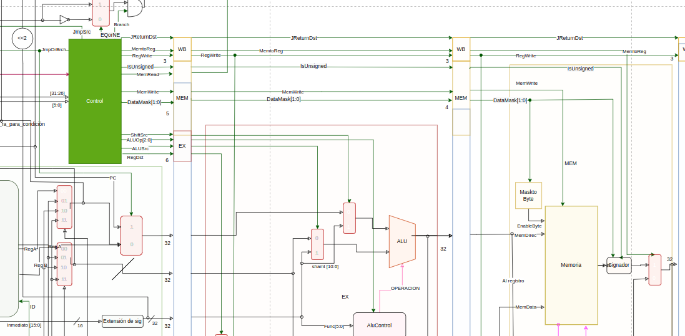

Se ve la unidad de control en la 2da etapa del pipeline destacado con color verde. Las señales viajan y entran en las unidades determinando el comportamiento de el procesador.

## Control de Riesgos

### Riesgos estructurales

Este tipo de riesgos son inherentes al disponibilidad de recursos, ya que surge al momento de no poder paralelizar el acceso a algunos recursos. En nuestro caso, es la memoria, ya que al momento de confeccionar el pipeline, si se posee una sola memoria en la cual se almacenan tanto como las instrucciones como los datos, en los ciclos en los cuales se ejecute la etapa **IF** y la **MEM**, se va a dar una lectura de la memoria, generando esto el conflicto anticipado.

La solución de esto, es como se vio en la descripción de las etapas, es separar esta información en 2 memorias físicas distintas.

### Riesgo de Datos

De este tipo de riesgos existen de 3 tipos:

- Escritura después de lectura (**WAR**)
- Escritura después de escritura (**WAW**)
- Lectura después de escritura (**RAW**)

> Notar que Lectura despues de lectura, no representa ningún conflicto.
> 

Los primeros 2 se solucionan al momento de diseñar el pipeline porque decisiones como que los registros se lean en la 2da etapa, que los registros se lean al final de la ultima y principalmente que todas las instrucciones duran lo mismo, permiten que ningún resultado se adelante respecto al otro.

No es el caso del **RAW**, ya que este problema se da cuando el dato que estoy por leer esta desactualizado respecto a las siguientes etapas.

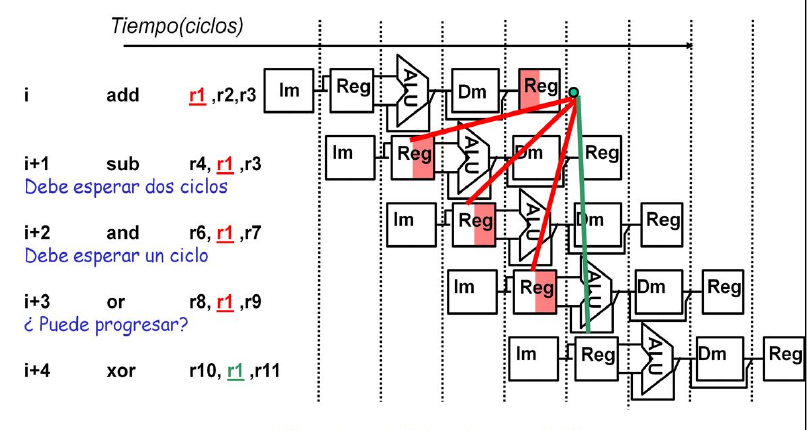

Captura obtenida de las clases de la cátedra de Arquitectura de computadoras, consultar bibliográfia

Por lo tanto, la solucion es emplear lo que se llama *unidad de cortocircuito*, que consiste en un modulo que testea cuales son los registros que se usan en cada etapa, y verificar la condición para que de esta manera, el dato que sale del registro sea el mas nuevo posible y no alguno que sea mas viejo.

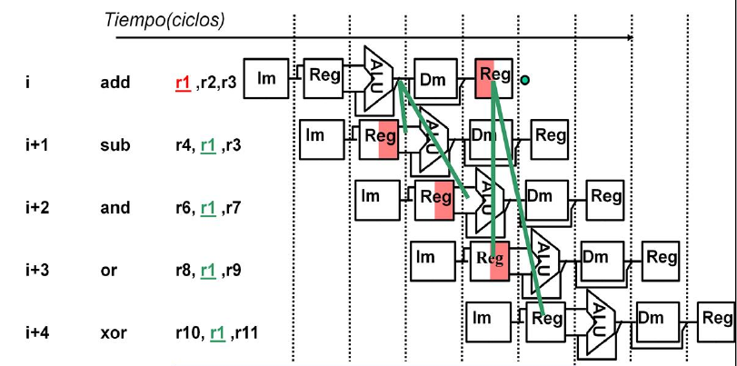

Las lineas verdes representan los cortocircuitos que se van pasando el dato actualizado, etapa por etapa.

El codigo usado para modelar este comportamiento es:

```verilog
assign o_forward_a = 
				(i_reg_wr_id_ex && (i_rd_id_ex != 0) && (i_rd_id_ex == i_rs_if_id)) 
        ? 2'b11 //Lo saca de la ALU (etapa de id/ex)
        : (i_reg_wr_ex_mem && (i_rd_ex_mem != 0) && (i_rd_ex_mem == i_rs_if_id)) 
        ? 2'b01 //Lo saca de la salida de la ALU (etapa ex/mem)
        : (i_reg_wr_mem_wb && (i_rd_mem_wb != 0) && (i_rd_mem_wb == i_rs_if_id)) 
        ? 2'b10 //Lo saca del WB
        : 2'b00; //Lo saca del registro
```

A la salida de este modulo, se obtiene 2 señales que indican a los multiplexores, de que etapa debe ser extraído el dato (o cortocircuitado, tambien se puede decir).

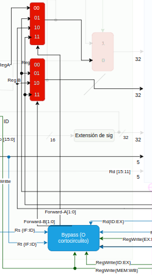

Conexiones entre el modulo y multiplexores

El dato que entra en los multiplexores viene del final de cada etapa con el dato que correspondería.

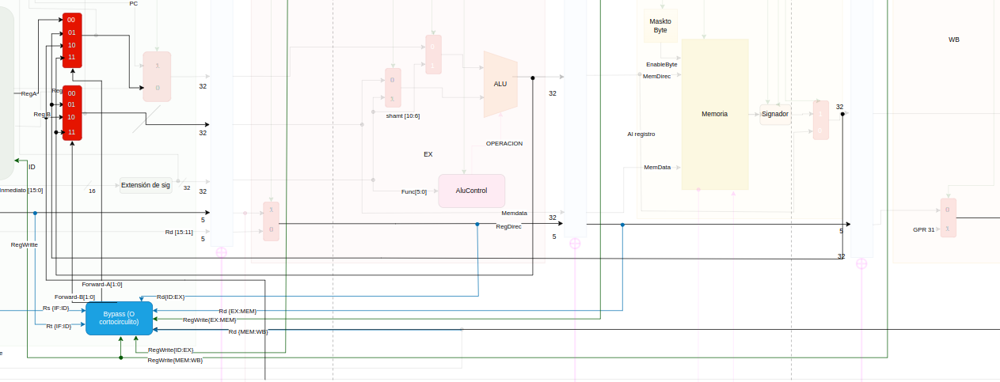

Conexionado entre etapas

Pero surge un problema mas respecto al **RAW**, porque resulta que existe casos donde el cortocircuito no alcanza, como cuando se da una instrucción de Load, es decir, el dato ya no sale de la **ALU**, sino que este recién esta listo al final de la etapa **MEM**, esto es problemático porque a la salida de registro no va a tener el dato que esta por ser leído en la siguiente etapa de la memoria.

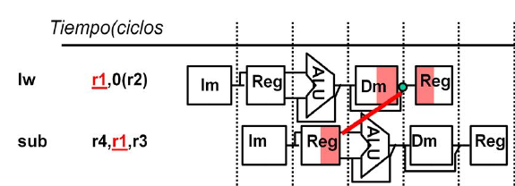

No es posible obtener el dato ya que aun no fue leido

La solucion a esto, es esperar un ciclo.


De tal forma es posible pedir el dato ya listo.

Para esto, es necesario implementar la *unidad de detección de riesgos*. La cual, debe detectar si se esta dando un *Load*, para generar un *stall*, es decir, introducir lo que se llama una burbuja o una operación vacía al medio.

Para modelar esto, se hizo lo siguiente:

```verilog
assign  o_is_risky = 
                     ((i_mem_read_id_ex) 
                     &&  (i_rt_id_ex == i_rs_if_id 
                     ||  i_rt_id_ex == i_rt_if_id)) 
                     ? 1'b1 
                     : 1'b0;
```

Para que se de el stall, se colocan las señales de control en 0, evitando que la instrucción genere algún cambio, y se frena el pipeline en las etapas anteriores. De esa forma, se incrusta, entre las instrucciones, una operación que no va tener efecto, y se atrasa la ejecución, un ciclo. Esto se va a ver mas detalladamente cuando se hable mas detenidamente de esta unidad.

### Riesgo de control

Los riesgos de control se dan cuando hay que decidir si se debe tomar un salto o no, pero esta decisión aun no se puede tomar, porque el dato a evaluar, aun no esta disponible.

Hay múltiples soluciones para este problema, la que se llevo adelante es la de predicción de salto con calculo adelantado de la condición. Es decir, todos los saltos se dan como no tomados, es decir, el flujo del pipeline y la carga de instrucciones no se detiene nunca, salvo cuando, el calculo de la condición es el acertado, entonces mediante la *unidad de detección de riesgos*, se genera una señal que evita que la instrucción siguiente al salto se ejecute, y se produce el salto, retomando a partir del nuevo **PC**.

Esto en la *unidad de detección de riesgos* se modela, simplemente verificando si alguna de las señales de control de salto se ponen en alto, lo cual, genera un “*Flush IF/ID*”, es decir, borra los datos de la instrucción que ya no debe ser ejecutada la cual estaba por pasar a la siguiente etapa del pipeline.


Se ven las entradas y salidas de la unidad de control

## Formas de Operar

Como se nombro en la introduccion, exiten 3 requisitos mas relacionados a la interaccion entre el procesador y el usuario. Para esto se diseño la **Super Unidad de Operacion y Debug** ($\text{SUOD}$*)*, el cual consiste en una gran maquina de estado que segun la entrada de usuario genera una accion.

### Acciones del S.U.O.D

El $\text{SUOD}$ es una unidad que provee un tipo de menu principal a la ejecucion del proyecto.
Esta tiene un conjunto de comandos que se reciben por **UART** y generan un conjunto de acciones.
Comandos:

| Comando | Comentario |
| --- | --- |
| “G” | modo Run, ejecuta el programa cargado. |
| “B” | Entra en modo “BootLoader” para que seguidamente se envie el binario hasta que reciba una intruccion halt. |
| “S” | Avanza un ciclo de clock. |
| “P” | Devuelve el PC. |
| “C” | Reinicia el programa |
| “T” | Incrementa el puntero de registro |
| “R” | Devuelve el valor del espacio de registro apuntado |
| “E” | Decrementa el puntero de registro |
| “,” | Incrementa el puntero de Memoria |
| “M” | Devuelve el valor del espacio de memoria apuntado |
| “N" | Decrementa el puntero de Memoria |
| “F” | Borra el programa cargado |

Esta se piensa como una gran maquina de estado que buclea a un estado de idle a partir del cual, según la entrada, cambia y vuelve.


Maquina de estado del SUOD.

### Carga de programa

La memoria de programa esta diseñada como una **FIFO**, mediante un flag va secuencialmente almacenando la instrucciones a medida que la $\text{SUOD}$, lo va orquestando a medida que el usuario los va enviando. Por lo tanto, es cuestion de enviar una “B” y posteriormente enviar una a una las instrucciones byte a byte para que se guarden, hasta que se envia una instruccion *Halt.*

### Modos

Los modos *paso a paso y continuos* se simplificaron en 2 señales, tales como son “**S**” de *Step* y “**R**” de *Run*. Es posible ir viendo el incremento de del **PC** en ambos casos y pedir cualquier puntero de memoria. El avance se hace a traves de un conjunto de *****enables***** que se colocan en 1 o en 0 segun se desea avanzar un ciclo.

 

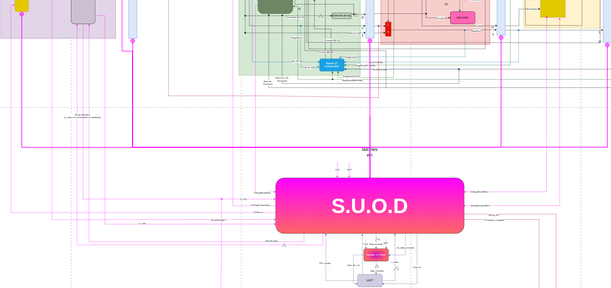

Conexionado de del enable con los Latches que separan cada etapa del pipeline. Tambien es posible las conexiones con las memorias.

### Pedir Datos

Las memorias son leidas por el puntero interno que tiene la $\text{SUOD}$ que pide en paralelo los datos y pueden ser leídos en cualquier momento de la ejecucion. Mediante “**R**” de *registro* se recibe el valor que apunta el puntero dentro del registro, “**E**” y “**T**”, *decrementan e incrementan* el puntero, siendo estas las letras previa y posterior en el teclado *QWERTY*. Mismo concepto aplica para “**M**” que pide el valor que se apunta en la *Memoria* con “**N**” y “**,**” como *decrementador e incrementador*.


Distintas señales de entrada y salidas del SUOD

.drawio.png)

Diseño del mips completo

# Clock Tree (Clock Wizard)

El *“Clock Tree Synthesis”* es una técnica para distribuir el clock equitativamente entre todas las partes secuenciales de nuestro diseño. El propósito del Clock Tree es reducir el [skew](https://en.wikipedia.org/wiki/Clock_skew) y el delay. Entonces lo que va a hacer este método es básicamente balancear el delay del clock a todas las entradas insertando buffers e inverters a lo largo de las rutas del diseño por las que transita nuestro reloj. Como resultado se consigue un balanceo del skew y se reduce la latencia que se inserta en el circuito.

Para conseguir esto en Vivado debemos generar un nuevo constraint para nuestro clock, el cual se consigue utilizando el clock wizard, una herramienta provista por el entorno de desarrollo. En ella podremos generar un nuevo módulo (el CTS) con varios clocks a la entrada y varios a la salida. En nuestro caso como solo queríamos bajar la velocidad del mismo simplemente tuvimos uno a la entrada y uno nuevo a la salida. Como se dijo con anterioridad esto se comporta como un módulo más y se instancia como tal, a continuación se adjunta el código de su instancia y su modelo en el esquemático.

```verilog
clk_wiz_0 clk_wiz
(
// Clock out ports
.clk_out64MHz(clk_out64MHz), // output clk_out64MHz
// Status and control signals
.reset(i_reset), // input reset
.locked(locked), // output locked
// Clock in ports
.clk_in1(i_clk)); // input clk_in1
```

---

*Instancia de un clock tree creada a partir del clock wizard de vivado*

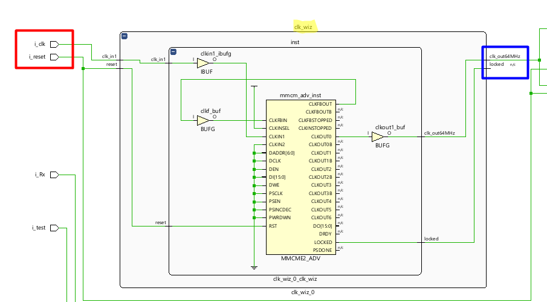

*Esquemático de la instancia del clock tree, se puede ver el ingreso de un clock de entrada (100MHz) y a su salida un clock de 64MHz.*

Si quiere saber cómo crear un módulo del clock tree utilizando el clock wizard de la herramienta, puede consultar el vídeo de la bibliografía.

# Referencia

> Cátedra de Arquitectura de Computadoras. Material de clase.
> 
> 
> Chu, Pong P. *FPGA Prototyping by Verilog Examples: Xilinx Spartan-3 Version*. Wiley, 2008. Accessed 27 January 2023.
> 
> Goldberg, David, et al. *Computer architecture : a quantitative approach*. Morgan Kaufman Publishers, 1990. Accessed 27 January 2023.
> 
> Patterson, David A., and John L. Hennessy. *Computer Organization and Design MIPS Edition: The Hardware/Software Interface*. Edited by David A. Patterson and John L. Hennessy, Elsevier Science, 2014. Accessed 27 January 2023.
> 
> Price, Charles. *MIPS IV Instruction Set*. 3.2 ed., 1995.
> 

[65 - Generating Different Clocks Using Vivado's Clocking Wizard](https://www.youtube.com/watch?v=ngkpvMaNapA)